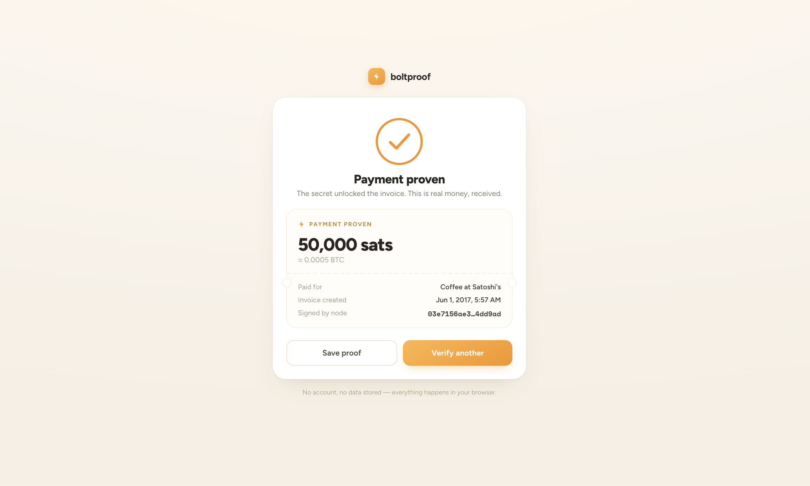

# boltproof

Verify Lightning Network payments in your browser — no account, no server, all local.

**[boltproof.app](https://boltproof.app)**



## What it does

Paste a BOLT11 invoice and the preimage (the payment secret). boltproof checks that:

1. The invoice signature is valid
2. `sha256(preimage)` matches the payment hash in the invoice

If both pass, the payment is proven. Only whoever actually paid receives the preimage, so a matching hash means the invoice was settled.

## Who it's for

- Merchants and freelancers confirming a customer really paid
- Anyone who wants a simple, shareable payment proof (downloadable as a text file)

## Privacy

Everything runs in your browser. Nothing is sent to a server or stored anywhere.

## Run locally

```bash
npm install
npm run dev
```

Build for production:

```bash
npm run build
```

Run tests:

```bash
npm test
```
